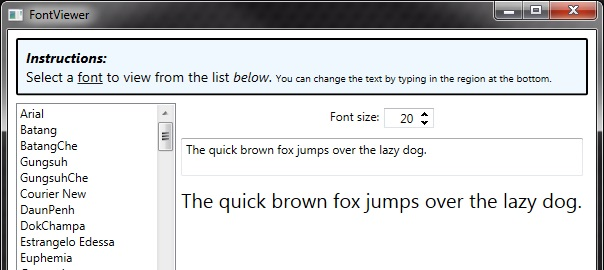

FontViewer
==========

My version of the FontViewer application as initially designed and developed in the book [Sams Teach Yourself WPF in 24 Hours](http://www.amazon.com/Sams-Teach-Yourself-WPF-Hours/dp/0672329859), with added IntegerUpDown control from [Extended.Wpf.Toolkit](https://wpftoolkit.codeplex.com/) NuGet package (for changing the font size).

Disclamer: I'm in no way affiliated with Amazon or this book, I just think it's great, for beginners especially. [This StackOverflow question](http://stackoverflow.com/questions/9591/what-wpf-books-would-you-recommend) may be useful if you're searching for a good book on learning WPF.

[FontViewerApplication.zip](FontViewerApplication.zip) contains the exe of the application which you can run, and the FontViewer.sln is the Visual Studio solution.

The accompanying blog post about how this application was written (step by step) can be found here: [http://www.nikola-breznjak.com/blog/codeproject/build-a-font-viewer-application-in-wpf-without-writing-any-c-code/](http://www.nikola-breznjak.com/blog/codeproject/build-a-font-viewer-application-in-wpf-without-writing-any-c-code/)